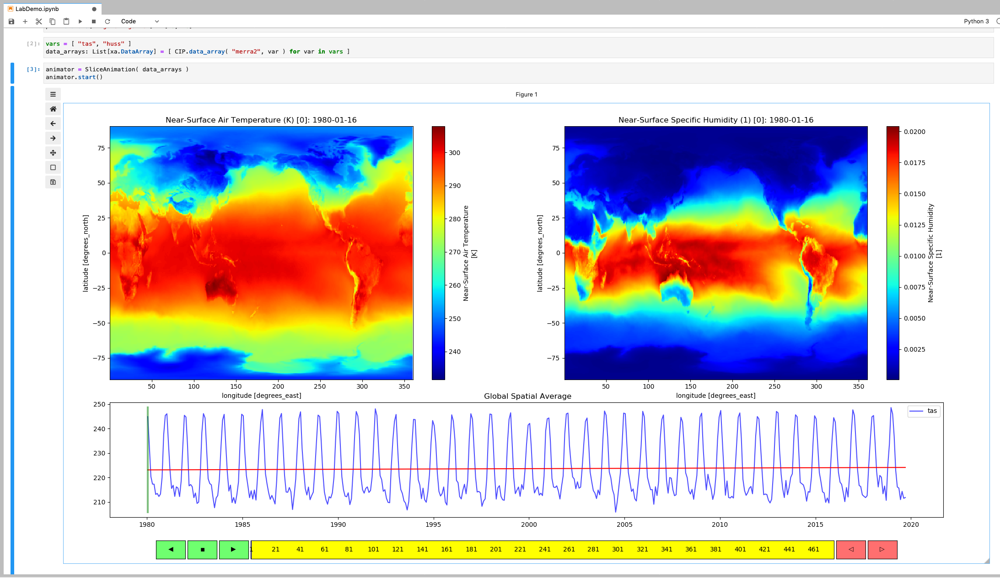

# jupyter-ilab
Jupyterlab Tools and Widgets developed for the NASA-NCCS Innovation Lab

### Installation
These instructions assume that jupyterlab has already been installed.  
*jupyterlab_env* is a conda environment that is used in jupyterlab.

* **Add jupyterlab extensions** (if not already present):
```
>> jupyter labextension install @jupyter-widgets/jupyterlab-manager
>> jupyter labextension install jupyter-matplotlib
```   

* **Add conda dependencies**

```
>> conda activate jupyterlab_env
(jupyterlab_env)>> conda install -c conda-forge xarray dask matplotlib numpy pandas scikit-learn netCDF4 ipympl nodejs
```    

* **Install jupyter-ilab**

```
    (jupyterlab_env)>> git clone https://github.com/nasa-nccs-cds/jupyter-ilab.git jupyter_ilab
    (jupyterlab_env)>> cd jupyter_ilab
    (jupyterlab_env)>> python setup.py install
```

* **Startup jupyter-ilab** 

```
    (jupyterlab_env)>> cd notebooks
    (jupyterlab_env)>> jupyter lab
```
* **Run the LabDemo.ipynb demo notebook**

This animation widget, shown in the screenshot below, displays two image timeseries.  The widget can display 1-4 timeseries.  
Each timeseries is expected to have 3 coordinate dimensions, in the order (t,y,x).



* **Interactivity** 

The animation widget features the following interaction modes:

    1. Click on the buttons on the left of the slider to animate forward or backward.
    2. Click on the buttons on the right of the slider to step forward or backward.
    3. Click on the body of the slider to jump to a particular animation frame.
    4. Click on the graph to jump the animation to that point.
    5. Click on an image to display a graph of the values at that point.
    6. Select zoom mode from the toolbar and drag-select a region to zoom to that region.  The graph displays an average over that region.
    7. Select pan mode from the toolbar and drag a selected region to move to that region.  The graph displays an average over the new region.
    8. Hover the mouse over any point on a graph or image to display the coordinates and value at that point.
    9. Click and drag the small grey rectangle at the lower right of the figure to resize the figure.